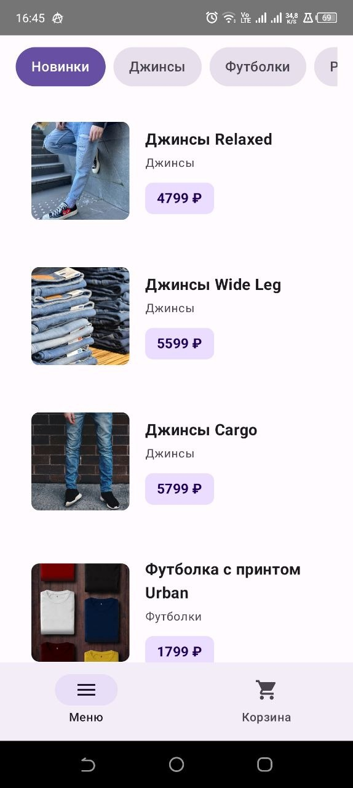
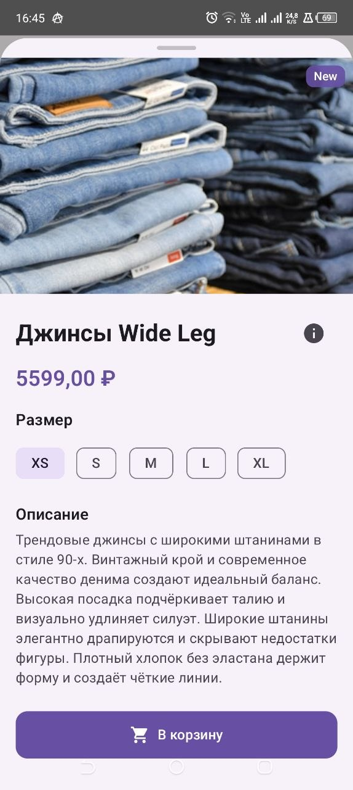
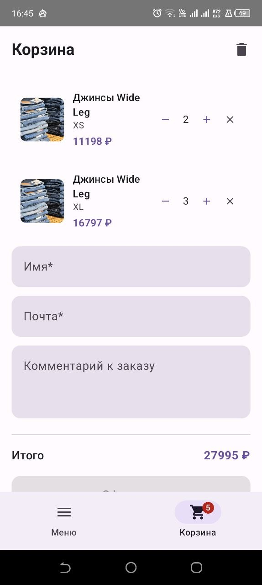
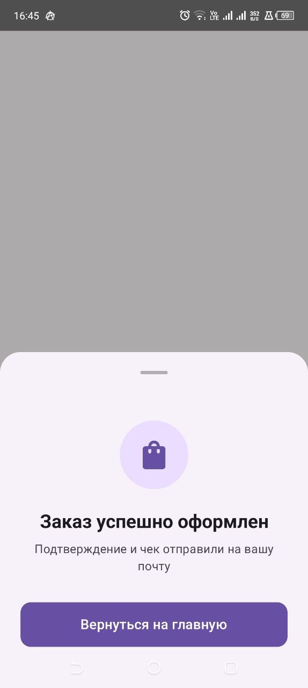
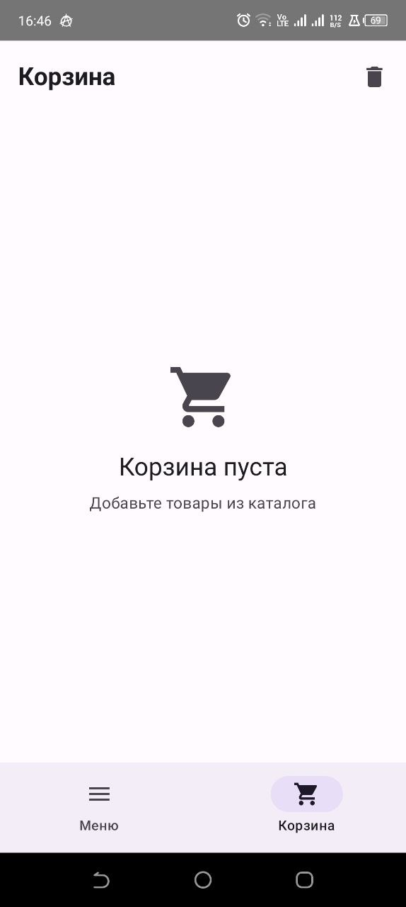

# ThreeBShop

## Описание проекта

ThreeBShop — это Android-приложение для интернет-магазина одежды, разработанное в рамках курса FEIP FEFU Mobile 2026. Приложение позволяет просматривать каталог товаров, добавлять их в корзину и оформлять заказы.

### Основные возможности

-  **Каталог товаров** с фильтрацией по категориям
-  **Детальный просмотр** товара с выбором размера
-  **Корзина** с управлением количеством товаров
-  **Оформление заказа** с формой контактных данных
-  **Локальное хранение** корзины (SharedPreferences)
-  **Восстановление корзины** при перезапуске приложения

##  Скриншоты











##  Технологии

- **Язык**: Kotlin
- **UI**: Jetpack Compose + Material 3
- **Архитектура**: MVVM
- **Сеть**: Retrofit + OkHttp
- **Загрузка изображений**: Coil
- **DI**: ViewModel + StateFlow
- **Хранение**: SharedPreferences + Gson
- **Сборка**: Gradle Kotlin DSL

##  Архитектура

Проект построен по паттерну **MVVM** с чётким разделением ответственности:
- `Гергенов Алексей` - Android разработчик, UI/UX
- `Корепанова Юлия` - дизайн
- `Жибцова Дарья` - тестировщик

##  Инструкция по сборке

### Требования

- Android Studio Hedgehog (2023.1.1) или новее
- JDK 17+
- Android SDK 34+
- Минимальная версия Android: API 26 (Android 8.0)

### Сборка проекта

1. **Клонируйте репозиторий:**
   ```bash
   git clone https://github.com/FEIP-FEFU-Mobile-Spring-2026/team-threeb.git
   cd team-threeb
   ```
2. **Открытие проекта в Android Studio**

1. Запустите Android Studio
2. Выберите File → Open...
3. Укажите путь к корню проекта (папка team-threeb)
4. Дождитесь завершения синхронизации Gradle (обычно 1–3 минуты)
5. При появлении запроса на обновление Gradle — согласитесь

3. **Сборка APK через командную строку**

   Debug-версия (для разработки и тестирования):
   ```bash
   ./gradlew assembleDebug
   ```
   Release-версия (для публикации):
   ```bash
   ./gradlew assembleRelease
   ```

Собранный APK находится по пути:

    Debug: app/build/outputs/apk/debug/app-debug.apk
    Release: app/build/outputs/apk/release/app-release.apk

4. **Запуск на устройстве или эмуляторе**
   Через Android Studio:

   Нажмите кнопку ▶️ Run (или Shift + F10)
   Выберите целевое устройство из списка

Через ADB (установка готового APK):
   ```bash
   adb install app/build/outputs/apk/debug/app-debug.apk
   ```
Запуск на физическом устройстве:

1. Включите Режим разработчика на устройстве (7 раз тапните по номеру сборки)
2. Включите Отладку по USB в настройках разработчика
3. Подключите устройство по USB
4. Подтвердите отладку на экране устройства